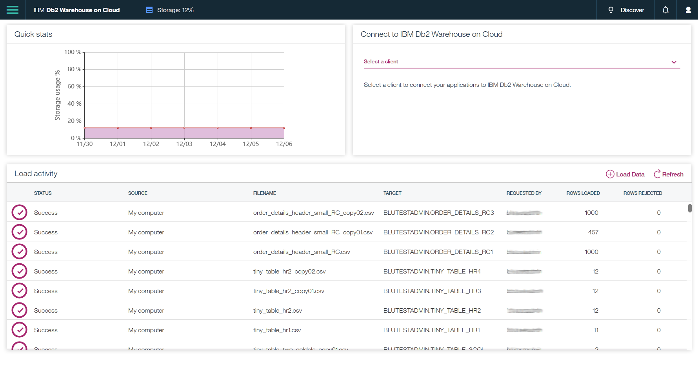

---

copyright:
  years: 2014, 2018
lastupdated: "2018-02-09"

---

<!-- Attribute definitions --> 
{:javascript: #javascript .ph data-hd-programlang='javascript'}
{:java: #java .ph data-hd-programlang='java'}
{:ruby: #ruby .ph data-hd-programlang='ruby'}
{:php: #php .ph data-hd-programlang='php'}
{:python: #python .ph data-hd-programlang='python'}
{:new_window: target="_blank"}
{:shortdesc: .shortdesc}
{:codeblock: .codeblock}
{:screen: .screen}
{:tip: .tip}
{:pre: .pre}

# Einführung
{: #getting_started}

Beim verwalteten {{site.data.keyword.dashdblong}}-Service handelt es sich um eine SQL-Datenbank, die für Sie in der Cloud bereitgestellt wird. Sie können Db2 Warehouse wie jede andere Datenbanksoftware verwenden, der Aufwand und die Kosten für die Hardwareeinrichtung sowie die Softwareinstallation und -verwaltung fallen jedoch weg. 
{: shortdesc}

## Kostenfreier Test
{: #freetrial}

Sie können den Einstiegsplan für {{site.data.keyword.dashdbshort_notm}} mit bis zu 1 GB Speicher kostenfrei testen. [Kostenfreier Test](https://console.bluemix.net/catalog/services/dashdb){:new_window}

## Schnittstellen
{: #interfaces}

Für die Arbeit mit der Warehousedatenbank stehen Ihnen die folgenden Möglichkeiten zur Verfügung:
{: shortdesc}

   * Webkonsole
   * REST-API
   * Herstellen einer Verbindung für Anwendungen oder bevorzugte Tools vom lokalen Computer
   * Verwenden von {{site.data.keyword.dashdbshort_notm}} als Datenquelle für {{site.data.keyword.Bluemix_notm}}-Apps oder -Services

### Webkonsole
{: #web_console}

Die Webkonsole bietet eine grafische Schnittstelle für alle Funktionen, die Sie für die Verwendung der Datenbank benötigen. Hierzu gehören z. B. Ladefunktionen, ein SQL-Editor, Treiberdownloads usw.
{: shortdesc}



<!-- Click the link to take a tour of the {{site.data.keyword.dashdbshort_notm}} for Analytics web console: [General tour ](http://ibm.biz/dashdb-general-quick-tour){:new_window}. -->

Für den Zugriff auf die Webkonsole stehen Ihnen die folgenden Möglichkeiten zur Verfügung:
   * Über das {{site.data.keyword.Bluemix_notm}}-Dashboard - Sie können die Webkonsole über die Servicedetailseite für Ihren {{site.data.keyword.dashdbshort_notm}}-Service öffnen.
   * Direkt über die URL - Sie können die URL der Webkonsole für Ihren {{site.data.keyword.dashdbshort_notm}}-Service mit einem Lesezeichen markieren.

### REST-API
{: #api}

Mit {{site.data.keyword.dashdbshort_notm}}-Serviceplänen können Sie Tasks im Zusammenhang mit dem Verwalten von Dateien, dem Laden von Daten und dem Ausführen von R-Scripts ausführen, indem Sie die [{{site.data.keyword.dashdbshort_notm}}-REST-API ](http://ibm.biz/dashdb-api){:new_window} verwenden.
{: shortdesc}

### Herstellen einer Verbindung für Anwendungen oder bevorzugte Tools vom lokalen Computer
{: #connect_apps}

Führen Sie die folgenden Schritte aus, um die lokale Umgebung für die Verbindung zur Db2 Warehouse-Datenbank zu konfigurieren:
{: shortdesc}

1. Laden Sie das [Treiberpaket](https://www.ibm.com/support/knowledgecenter/SS6NHC/com.ibm.swg.im.dashdb.doc/connecting/connect_driver_package.html){:new_window} von der Db2 Warehouse on Cloud-Webkonsole herunter.
2. [Installieren Sie das Treiberpaket ](https://www.ibm.com/support/knowledgecenter/SS6NHC/com.ibm.swg.im.dashdb.doc/connecting/connect_driver_package_install.html){:new_window} auf dem Computer, auf dem Ihre Apps bzw. Tools ausgeführt werden.
3. [Konfigurieren Sie die Treiberdateien](https://www.ibm.com/support/knowledgecenter/en/SS6NHC/com.ibm.swg.im.dashdb.doc/connecting/connect_driver_package_config.html){:new_window} für die Db2 Warehouse-Datenbank.

### Verwenden von Db2 Warehouse on Cloud als Datenquelle für {{site.data.keyword.Bluemix_notm}}-Apps oder -Services
{: #data_src}

Für Apps, die per Hosting in {{site.data.keyword.Bluemix_notm}} bereitgestellt werden, können Verbindungen zu Ihrer {{site.data.keyword.dashdbshort_notm}}-Datenbank auf dieselbe Weise hergestellt werden wie bei Verbindungen für lokalen Anwendungen zu Ihrer {{site.data.keyword.dashdbshort_notm}}-Datenbank.
{: shortdesc}

Wenn Ihre Apps die {{site.data.keyword.Bluemix_notm}}-Plattform verwenden, können Sie die Umgebungsvariable `VCAP _SERVICES` nutzen, um das Angeben von Datenbankdetails und -berechtigungsnachweisen zu vereinfachen:
1. Klicken Sie im {{site.data.keyword.Bluemix_notm}}-Dashboard auf der Registerkarte **Verbindungen** der Servicedetailseite für Ihren {{site.data.keyword.dashdbshort_notm}}-Service auf die Schaltfläche **Verbindung erstellen**.
2. Wählen Sie die {{site.data.keyword.Bluemix_notm}}-App aus, die mit der {{site.data.keyword.dashdbshort_notm}}-Datenbank als Datenquelle verwendet werden soll, und klicken Sie dann auf die Schaltfläche **Verbinden**.
3. Aktualisieren Sie den Anwendungscode, um Datenbankdetails- und -berechtigungsnachweise aus der Umgebungsvariablen `VCAP_SERVICES` abzurufen.

    **Beispiel ohne `VCAP_SERVICES`**

    ```php
    <?php
    $driver      = "DRIVER={IBM DB2 ODBC DRIVER};";

    $database    = "BLUDB";         # Diese Datenbankdetails von
    $hostname    = "<Host-name>";   # der Seite mit Verbindungsinformationen
    $port        = 50000;           # der Webkonsole abrufen.
    $user        = "<Benutzer-ID >";    #
    $password    = "<Kennwort>";    #
    $dsn         = "DATABASE=$database;" .
                   "HOSTNAME=$hostname;" .
                   "PORT=$port;" .
                   "PROTOCOL=TCPIP;" .
                   "UID=$user;" .
                   "PWD=$password;";

    $conn_string = $driver . $dsn;

    $conn        = db2_connect( $conn_string, "", "" );
    ?>
    ```

    **Beispiel mit `VCAP_SERVICES`**

    ```php
    <?php
    $driver      = "DRIVER={IBM DB2 ODBC DRIVER};";

    $vcap        = json_decode( getenv( "VCAP_SERVICES" ), true );
    $dsn         = $vcap[ "dashDB" ][0][ "credentials" ][ "dsn" ];

    $conn_string = $driver . $dsn;
                                   
    $conn        = db2_connect( $conn_string, "", "" );
    ?>
    ```

## Beispiele
{: #samples}

Über die folgenden Links können Sie Beispiele aufrufen, die veranschaulichen, wie Sie eine Verbindung von Anwendungen in verschiedenen Sprachen zu Ihrer {{site.data.keyword.dashdbshort_notm}}-Datenbank herstellen:
{: shortdesc}

   * [.NET ](https://www.ibm.com/support/knowledgecenter/SS6NHC/com.ibm.swg.im.dashdb.doc/connecting/connect_connecting__net_applications.html){:new_window}
<!-- * [JAVA ](https://www.ibm.com/support/knowledgecenter/SS6NHC/com.ibm.swg.im.dashdb.doc/connecting/connect_connecting_java.html){:new_window} -->
   * [JDBC ](https://www.ibm.com/support/knowledgecenter/SS6NHC/com.ibm.swg.im.dashdb.doc/connecting/connect_connecting_jdbc_applications.html){:new_window}
<!-- * [Node.js ](https://www.ibm.com/support/knowledgecenter/SS6NHC/com.ibm.swg.im.dashdb.doc/connecting/connect_connecting_nodejs.html){:new_window} -->
   * [PHP ](https://www.ibm.com/support/knowledgecenter/SS6NHC/com.ibm.swg.im.dashdb.doc/connecting/connect_connecting_php.html){:new_window}
<!-- * [Python ](https://www.ibm.com/support/knowledgecenter/SS6NHC/com.ibm.swg.im.dashdb.doc/connecting/connect_connecting_python.html){:new_window} -->
   * [{{site.data.keyword.dashdbshort_notm}}-Beispiele in GitHub ](https://github.com/IBM-Bluemix/dashdb-nodejs-helloworld){:new_window}


