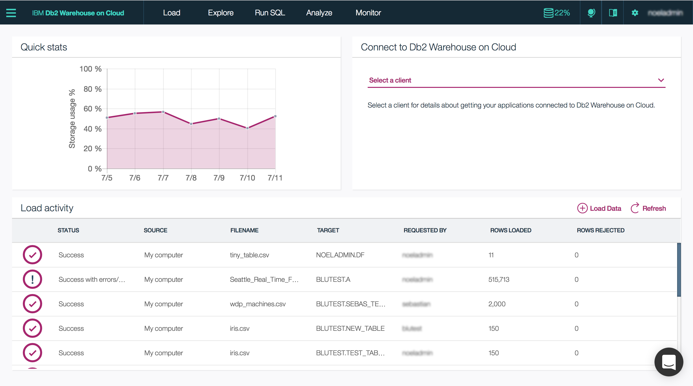

---

copyright:
  years: 2014, 2018
lastupdated: "2017-07-17"

---

<!-- Attribute definitions --> 
{:javascript: #javascript .ph data-hd-programlang='javascript'}
{:java: #java .ph data-hd-programlang='java'}
{:ruby: #ruby .ph data-hd-programlang='ruby'}
{:php: #php .ph data-hd-programlang='php'}
{:python: #python .ph data-hd-programlang='python'}
{:new_window: target="_blank"}
{:shortdesc: .shortdesc}
{:codeblock: .codeblock}
{:screen: .screen}
{:tip: .tip}
{:pre: .pre}

# Iniciación a Db2 Warehouse on Cloud (anteriormente dashDB for Analytics)
{: #getting_started}

El servicio gestionado de {{site.data.keyword.IBM}} Db2 Warehouse on Cloud es una base de datos SQL suministrada para usted en la nube. Puede utilizar Db2 Warehouse como utilizaría cualquier software de base de datos, pero sin la sobrecarga ni el gasto de la configuración de hardware o la instalación y el mantenimiento de software.
{: shortdesc}

## Interfaces
{: #interfaces}

Puede trabajar con la base de datos de Db2 Warehouse de los siguientes modos:
{: shortdesc}

   * Desde la consola web
   * API REST
   * Conecte aplicaciones o herramientas preferidas desde el sistema local
   * Utilice Db2 Warehouse on Cloud como origen de datos para apps o servicios de Bluemix

### Consola web
{: #web_console}

La consola web proporciona una interfaz gráfica para todo lo que puede utilizar su base de datos, incluyendo: recursos de cargas, un editor SQL, descargas de controladores, etc.
{: shortdesc}



<!-- Click the link to take a tour of the {{site.data.keyword.dashdbshort_notm}} for Analytics web console: [General tour ](http://ibm.biz/dashdb-general-quick-tour "External link icon"){:new_window}. -->

Puede acceder a la consola web de los siguientes modos:
   * Desde el panel de control de {{site.data.keyword.Bluemix_notm}} - Puede abrir la consola web desde la página Detalles de servicio para el servicio Db2 Warehouse on Cloud.
   * URL directo - Puede marcar como favorito el URL de la consola web para el servicio Db2 Warehouse on Cloud.

### API REST
{: #api}

Con los panes de servicio de Db2 Warehouse on Cloud, puede realizar tareas relacionadas con la gestión de archivos, carga de datos y ejecución de scripts R utilizando la [API REST de Db2 Warehouse on Cloud ](http://ibm.biz/dashdb-api "Icono de enlace externo"){:new_window}.
{: shortdesc}

### Conecte aplicaciones o herramientas preferidas desde el sistema local
{: #connect_apps}

Configure el entorno local para conectar la base de datos de Db2 Warehouse on Cloud siguiendo estos pasos:
{: shortdesc}

1. Descargue el [paquete de controladores ](https://www.ibm.com/support/knowledgecenter/SS6NHC/com.ibm.swg.im.dashdb.doc/connecting/connect_driver_package.html "Icono de enlace externo"){:new_window} desde la consola web de Db2 Warehouse on Cloud.
2. [Instale el paquete de controladores ](https://www.ibm.com/support/knowledgecenter/SS6NHC/com.ibm.swg.im.dashdb.doc/connecting/connect_driver_package_install.html "Icono de enlace externo"){:new_window} en el sistema donde esté ejecutando las apps o las herramientas.
3. [Configure los archivos de controladores ](https://www.ibm.com/support/knowledgecenter/en/SS6NHC/com.ibm.swg.im.dashdb.doc/connecting/connect_driver_package_config.html "Icono de enlace externo"){:new_window} para la base de datos de Db2 Warehouse.

### Utilice Db2 Warehouse on Cloud como origen de datos para apps o servicios de Bluemix
{: #data_src}

Las apps alojadas en {{site.data.keyword.Bluemix_notm}} pueden conectarse a la base de datos de Db2 Warehouse on Cloud exactamente del mismo modo que pueden conectarse las aplicaciones locales a la base de datos de Db2 Warehouse on Cloud.
{: shortdesc}

Cuando las apps utilizan la plataforma de {{site.data.keyword.Bluemix_notm}}, puede sacar partido de la variable de entorno `VCAP _SERVICES` para simplificar la tarea de especificar detalles y credenciales de bases de datos:
1. En el panel de control de {{site.data.keyword.Bluemix_notm}}, en el separador **Conexiones** de la página Detalles del servicio para el servicio Db2 Warehouse on Cloud, pulse el botón **Crear conexión**.
2. Seleccione la app de {{site.data.keyword.Bluemix_notm}} para utilizarla con la base de datos de Db2 Warehouse on Cloud como origen de datos y luego pulse el botón **Conectar**.
3. Actualice el código de aplicación para recuperar detalles y credenciales de la base de datos desde la variable de entorno `VCAP_SERVICES`:

    **Ejemplo sin `VCAP_SERVICES`**

    ```php
    <?php
    $driver      = "DRIVER={IBM DB2 ODBC DRIVER};";

    $database    = "BLUDB";         # Obtenga los detalles de la base de datos desde
    $hostname    = "<Host-name>";   # la página Conectar de dashDB
    $port        = 50000;           # consola web.
    $user        = "<User-ID >";    #
    $password    = "<Password>";    #
    $dsn         = "DATABASE=$database;" .
                   "HOSTNAME=$hostname;" .
                   "PORT=$port;" .
                   "PROTOCOL=TCPIP;" .
                   "UID=$user;" .
                   "PWD=$password;";

    $conn_string = $driver . $dsn;

    $conn        = db2_connect( $conn_string, "", "" );
    ?>
    ```

    **Ejemplo con `VCAP_SERVICES`**

    ```php
    <?php
    $driver      = "DRIVER={IBM DB2 ODBC DRIVER};";

    $vcap        = json_decode( getenv( "VCAP_SERVICES" ), true );
    $dsn         = $vcap[ "dashDB" ][0][ "credentials" ][ "dsn" ];

    $conn_string = $driver . $dsn;
                                   
    $conn        = db2_connect( $conn_string, "", "" );
    ?>
    ```

## Ejemplos
{: #samples}

Aquí tiene los enlaces a ejemplos que demuestran cómo conectarse a la base de datos de Db2 Warehouse on Cloud desde aplicaciones en distintos idiomas:
{: shortdesc}

   * [.NET ](https://www.ibm.com/support/knowledgecenter/SS6NHC/com.ibm.swg.im.dashdb.doc/connecting/connect_connecting__net_applications.html "Icono de enlace externo"){:new_window}
<!-- * [JAVA ](https://www.ibm.com/support/knowledgecenter/SS6NHC/com.ibm.swg.im.dashdb.doc/connecting/connect_connecting_java.html "External link icon"){:new_window} -->
   * [JDBC ](https://www.ibm.com/support/knowledgecenter/SS6NHC/com.ibm.swg.im.dashdb.doc/connecting/connect_connecting_jdbc_applications.html "Icono de enlace externo"){:new_window}
<!-- * [Node.js ](https://www.ibm.com/support/knowledgecenter/SS6NHC/com.ibm.swg.im.dashdb.doc/connecting/connect_connecting_nodejs.html "External link icon"){:new_window} -->
   * [PHP ](https://www.ibm.com/support/knowledgecenter/SS6NHC/com.ibm.swg.im.dashdb.doc/connecting/connect_connecting_php.html "Icono de enlace externo"){:new_window}
<!-- * [Python ](https://www.ibm.com/support/knowledgecenter/SS6NHC/com.ibm.swg.im.dashdb.doc/connecting/connect_connecting_python.html "External link icon"){:new_window} -->
   * Ejemplos de [Ejemplos de Db2 Warehouse on Cloud en GitHub ](https://github.com/IBM-Bluemix/dashdb-nodejs-helloworld "Icono de enlace externo"){:new_window}


