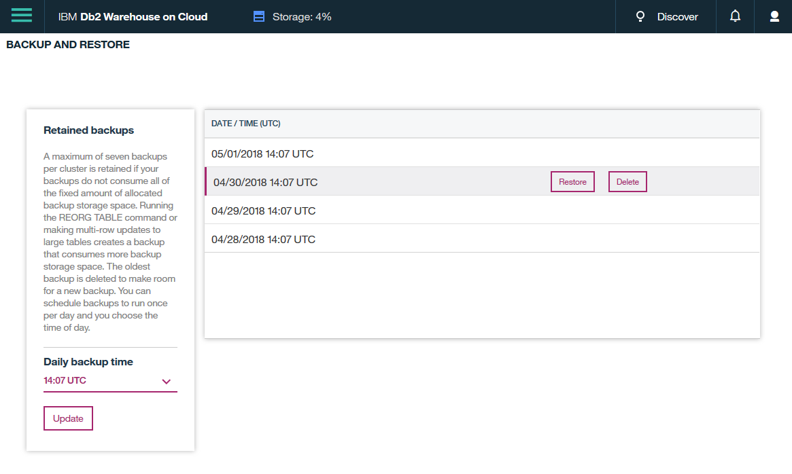

---

copyright:
  years: 2014, 2019
lastupdated: "2018-05-10"

keywords:

subcollection: Db2whc

---

<!-- Attribute definitions --> 
{:new_window: target="_blank"}
{:shortdesc: .shortdesc}
{:codeblock: .codeblock}
{:screen: .screen}
{:tip: .tip}
{:important: .important}
{:note: .note}
{:deprecated: .deprecated}
{:pre: .pre}

# Backup e ripristino
{: #br}

Un backup crittografato del database {{site.data.keyword.dashdbshort_notm}} completo viene eseguito una volta al giorno.
{: shortdesc}

| Piano              | Frequenza backup | Numero di backup conservati | Periodo di conservazione backup   | Self service |
|-------------------|------------------|----------------------------|---------------------------|--------------|
| MPP               | 1 / giorno          | 2                          | 2 giorni; rollover FIFO*   | No           |
| Flex Performance  | 1 / giorno          | 7                          | 7 giorni; rollover FIFO*   | Sì          |
{: caption="Tabella 1. Frequenza e conservazione dei backup" caption-side="top"}

*First in, first out

## Piani SMP e MPP
{: #smp_mpp}

Vengono conservati gli ultimi 2 backup giornalieri.

I backup conservati vengono utilizzati esclusivamente da IBM solo per scopi di ripristino del sistema nel caso di un'emergenza o di una perdita del sistema. Una richiesta per ripristinare il tuo database da un backup non è supportata. Puoi esportare i dati utilizzando gli strumenti Db2 come IBM Data Studio o utilizzando il comando **db2 export**. 

## Piano Flex Performance
{: #flex}

Vengono conservate le ultime 7 istantanee di backup giornaliere.

Dalla console {{site.data.keyword.dashdbshort_notm}}, puoi pianificare i tuoi backup per essere eseguiti quando ti è più conveniente e puoi ripristinare il tuo database da una qualsiasi delle tue istantanee di backup conservate, in qualsiasi momento tu voglia. Il sistema si arresta durante il periodo di ripristino. Verrà inviata un'email per informarti che l'operazione di ripristino è stata completata.

