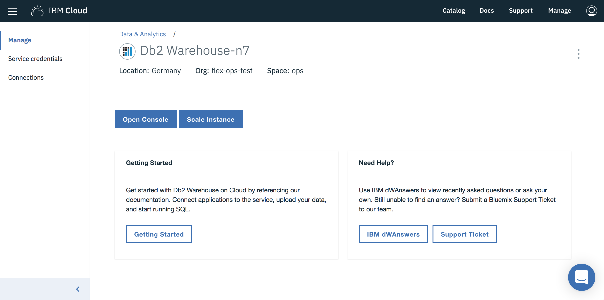

---

copyright:
  years: 2014, 2018
lastupdated: "2018-05-01"

---

<!-- Attribute definitions --> 
{:new_window: target="_blank"}
{:shortdesc: .shortdesc}
{:codeblock: .codeblock}
{:screen: .screen}
{:pre: .pre}

# 柔軟なスケーリング
{: #scale}

Flex Performance プランでは、ストレージとコンピュート・コアを別々にスケーリングできます。 
{: shortdesc}

Flex Performance システムをプロビジョンする前に、ストレージとコンピュート・コアに関して期待する要件に合わせて最初の調整を行い、その後、選択内容をサブミットします。

システムがプロビジョンされた後、要件に変更があれば、サービスの**「管理」**ページから**「インスタンスのスケーリング (Scale Instance)」**ページを起動し、スライダー・バーを使用して、いつでもコンピュート・コアとストレージの要件を調整できます。

## コンピュート・コア
{: #cores}

コンピュート・コアは上下に調整できます。 コンピュート・コアを変更すると、最長 45 分間の短いシステム・ダウン時間が発生します。 都合のよい時間にダウン時間が発生するようにスケジュールしたり、コンピュート・コアの変更を直ちに開始したりできます。

## ストレージ
{: #storage}

ストレージは増やすことができます。 ストレージの変更ではダウン時間は発生しません。

## メモリー
{: #ram}

RAM は、コンピュート・コアの数が変更されると、それに比例して、固定した比率で割り当てられます。

