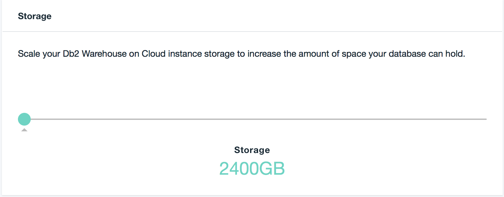

---

copyright:
  years: 2014, 2019
lastupdated: "2018-05-01"

---

<!-- Attribute definitions --> 
{:new_window: target="_blank"}
{:shortdesc: .shortdesc}
{:codeblock: .codeblock}
{:screen: .screen}
{:tip: .tip}
{:important: .important}
{:note: .note}
{:deprecated: .deprecated}
{:pre: .pre}

# 유연한 스케일링
{: #scale}

Flex Performance 플랜은 스토리지 및 컴퓨팅 코어의 독립적인 스케일링을 제공합니다. 
{: shortdesc}

Flex Performance 시스템을 프로비저닝하기 전에, 사용자는 스토리지 및 컴퓨팅 코어에 대한 예상 요구사항에 맞추어 초기 조정을 수행하고 선택사항을 제출합니다.

시스템이 프로비저닝된 후 요구사항이 변경될 때마다 서비스의 **관리** 페이지에서 **스케일 인스턴스**를 시작하고 슬라이더 막대를 사용하여 컴퓨팅 코어 및 스토리지 요구사항을 조정할 수 있습니다.

## 컴퓨팅 코어
{: #cores}

컴퓨팅 코어를 위 또는 아래로 조정할 수 있습니다. 컴퓨팅 코어가 변경되면 최대 45분의 짧은 시스템 작동 중단 시간이 발생합니다. 사용자는 더 편리한 시간에 발생하도록 작동 중단 시간을 스케줄하거나 컴퓨팅 코어 변경을 즉시 시작할 수 있습니다.

## 스토리지
{: #storage}

스토리지를 늘릴 수 있습니다. 스토리지 변경에서는 작동 중단 시간이 발생하지 않습니다.

## 메모리
{: #ram}

RAM은 컴퓨팅 코어 수가 변경됨에 따라 고정 비율로 비례하여 할당됩니다.

