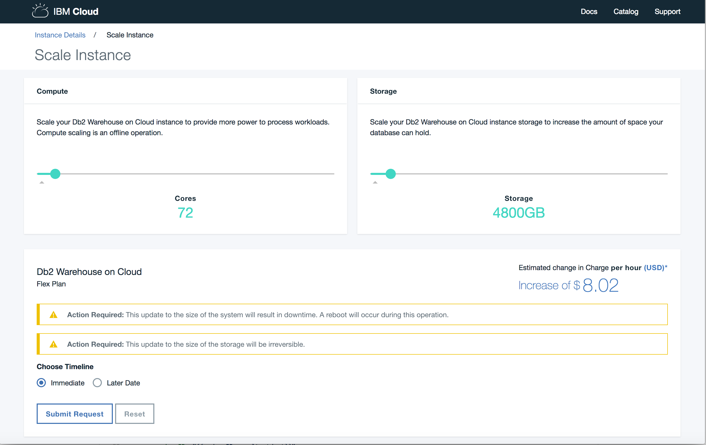

---

copyright:
  years: 2014, 2019
lastupdated: "2018-05-01"

keywords:

subcollection: Db2whc

---

<!-- Attribute definitions --> 
{:new_window: target="_blank"}
{:shortdesc: .shortdesc}
{:codeblock: .codeblock}
{:screen: .screen}
{:tip: .tip}
{:important: .important}
{:note: .note}
{:deprecated: .deprecated}
{:pre: .pre}

# 灵活扩展
{: #scale}

Flex Performance 套餐提供独立扩展的存储和计算核心。
{: shortdesc}

在供应 Flex Performance 系统之前，进行初始调整以满足预期的存储和计算核心需求，然后提交选择。

在供应系统后，每当需求发生更改时，可通过从服务的**管理**页面启动**扩展实例**并使用滑块栏来调整计算核心和存储需求。

## 计算核心
{: #cores}

您可以向上或向下调整计算核心。计算核心更改将导致系统短暂停机，最多为 45 分钟。您可以将停机时间安排在更方便的时间，或者立即开始计算核心更改。

## 存储
{: #storage}

您可以增加存储。存储更改不会产生任何停机时间。

## 内存
{: #ram}

RAM 会随着计算核心数量的更改，按固定比例进行分配。

