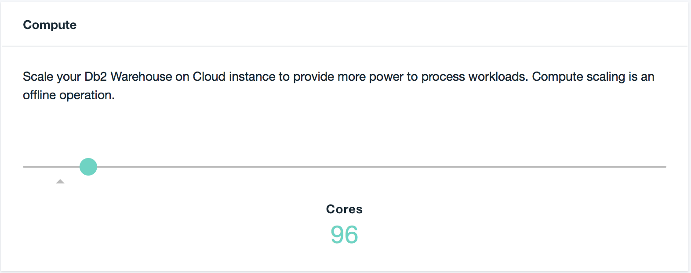

---

copyright:
  years: 2014, 2019
lastupdated: "2018-05-01"

keywords:

subcollection: Db2whc

---

<!-- Attribute definitions --> 
{:external: target="_blank" .external}
{:shortdesc: .shortdesc}
{:codeblock: .codeblock}
{:screen: .screen}
{:tip: .tip}
{:important: .important}
{:note: .note}
{:deprecated: .deprecated}
{:pre: .pre}

# 彈性調整
{: #scale}

「彈性效能」方案提供儲存空間及運算核心的獨立調整能力。
{: shortdesc}

在佈建「彈性效能」系統之前，請進行起始調整，以符合您預期的儲存空間及運算核心需求，然後提交您的選擇。

在佈建系統之後，每當您的需求變更，您就可以調整運算核心及儲存空間需求，方法為從服務的**管理**頁面中啟動**調整實例**，並使用滑塊列。

## 運算核心
{: #cores}

您可以上下調整運算核心。運算核心變更會造成短暫的系統關閉時間，最長為 45 分鐘。您可以將關閉排定在較方便的時間進行，或是立即開始變更運算核心。

## 儲存空間
{: #storage}

您可以增加儲存空間。儲存空間變更不會引起任何關閉時間。

## 記憶體
{: #ram}

當運算核心數目變更時，RAM 會依固定比例進行配置。

